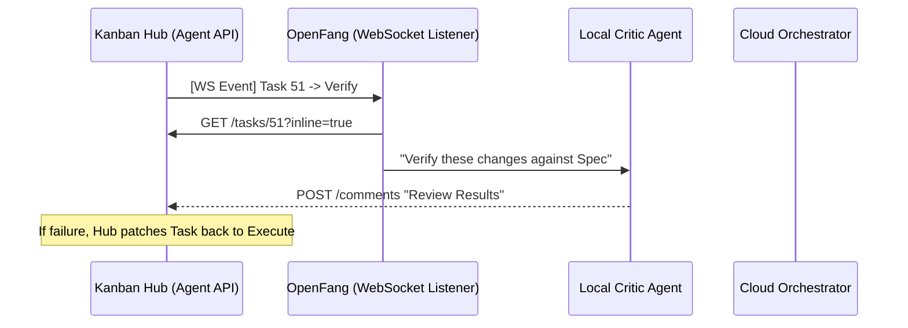

# Brainstorm: Blended Agent Skill Lifecycle
**Project:** Spec Task Board (ID: 10)
**Status:** Refined / Swarm Architecture
**Date:** 2026-04-08

## 1. Project Types & Architectural Flexibility
*   **Structured Epics:** Full workflows (Discovery -> Finalized).
*   **Freeform:** Simple Todo -> Done.
*   **Hybrid:** Structured parent Epics spawning sandboxed sub-boards.

## 2. Distributed Agent Swarm (Specialized Local Agents)
We leverage the WebSocket feed and OpenFang/OpenClaw to resource a swarm of small, local agents.

*   **Research Agent:** Triggered by `Plan`. Uses `code_index` to pre-fetch context. Logs `📁 [FILES TO REVIEW]`.
*   **Critic Agent:** Triggered by `Verify`. Compares code diffs against `SPECIFICATION.md`.
*   **Memory Agent:** Inspired by `OpenMemory`. Distills long comment threads into lean `BRAINSTORM` artifacts.

## 3. The Execution Protocol (Mermaid Flow)

## 4. Refined Agent API Call Stack
*   `GET /api/agent/projects/:id/tasks/:id?inline=true&compact=true` (Context Acquisition)
*   `POST /api/agent/projects/:id/docs` (Knowledge Commitment)
*   `POST /api/agent/projects/:id/tasks/:id/comments` (Work Logging)
*   `POST /api/agent/projects/:id/tasks/:id/doc-links` (Context Binding)