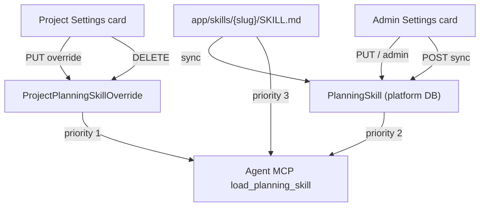

# Skills maintenance — Settings UI plan

**Status:** Plan only — do not implement until explicitly requested.  
**Scope:** Platform-level (global admin) and project-level (Maintainer+) planning skill maintenance in the Settings hub.

---

## Why this exists

Planning skills (`SKILL.md` content) drive agent-guided flows such as draft project grilling. The hub already persists and resolves skills; the web app does not expose them yet.

| Layer | Resolution order | Storage today |
|-------|------------------|---------------|
| **Effective content** | Project override → global DB → filesystem `app/skills/{slug}/SKILL.md` | `getEffectiveSkillContent()` |
| **Platform (global)** | DB (+ optional sync from filesystem) | `PlanningSkill`, `PlanningSkillRevision` |
| **Project** | Per-project override only | `ProjectPlanningSkillOverride` |

Agents load skills via `GET /api/agent/planning/skills/:slug` (platform session) and MCP `load_planning_skill`. Humans have **no Settings UI** for edit, sync, or override management.

---

## Current API surface (implemented, not in OpenAPI)

### Platform — admin only (`requireAdmin`)

| Method | Path | Purpose |
|--------|------|---------|
| `GET` | `/api/admin/planning-skills` | List global DB skills (`slug`, `contentHash`, `updatedAt`) |
| `POST` | `/api/admin/planning-skills/sync` | Import/update from `app/skills/` filesystem |
| `GET` | `/api/admin/planning-skills/:slug` | Effective global content (no project override) |
| `PUT` | `/api/admin/planning-skills/:slug` | Upsert global skill + revision row |
| `GET` | `/api/admin/planning-skills/:slug/revisions` | Last 20 revisions |
| `POST` | `/api/admin/planning-skills/:slug/revert` | Restore revision (`revisionId`) |

### Project — membership (`/api/projects/:projectId/planning/skills`)

| Method | Path | Role | Purpose |
|--------|------|------|---------|
| `GET` | `/:slug` | Viewer+ | Effective content (override applied) |
| `PUT` | `/:slug` | Maintainer+ | Upsert project override |

### Agent — platform session

| Method | Path | Purpose |
|--------|------|---------|
| `GET` | `/api/agent/planning/skills/:slug?projectId=` | Load effective skill for MCP/CLI |

### Filesystem defaults (dev/deploy)

- `app/skills/project-planning-grill/SKILL.md` (only bundled skill today)
- `syncFilesystemDefaultsToDb()` via admin **Sync** only (`POST /api/admin/planning-skills/sync`) — **not** on hub startup today

---

## Gaps before UI

| Gap | Impact | Proposed fix |
|-----|--------|--------------|
| **Not in OpenAPI** | No generated frontend types; contract drift | Add schemas + paths; validate → sync → gen-types |
| **No skill catalog endpoint** | UI cannot list filesystem-only skills not yet synced | `GET /api/admin/planning-skills/catalog` — merge FS slugs + DB rows + `source: filesystem \| db \| both` |
| **No project override list** | Project card cannot show “customized” badges | `GET /api/projects/:id/planning/skills` — slugs with override + `updatedAt` |
| **No project override delete** | Cannot reset to global default from UI | `DELETE /api/projects/:id/planning/skills/:slug` — Maintainer+ |
| **No project revisions** | Safer editing only on platform today | **Defer** — v1 uses single override + “Reset to platform default” |
| **No integration tests** | Regressions invisible | Add hub tests for catalog, project list, delete override; mount planning-skills routes in `test-server.ts` |
| **No frontend API module** | — | `planningSkillsApi.ts` + composables |
| **Weak save validation** | Skills use minimal `scanSkillContent`; docs/agent paths use zod + tree-sitter | Run `parseMarkdown()` on skill PUT (same pipeline as agent document create) |
| **Orphan slug PUT** | Admin/project can upsert arbitrary slug pattern today | v1: **catalog-only** — reject PUT when slug ∉ catalog (FS ∪ DB) |

---

## UX design

### Placement (Settings hub — one card each, not a new nav section)

Follow existing pattern: **SettingsCard** + **DraggableSettingsGrid** for platform admin; project surface mixes fixed + grid cards (see below).

| Surface | Section | Card name | Who sees it | Who edits |
|---------|---------|-----------|-------------|-----------|
| **Platform** | `Settings → Administration` (`AdminSection.vue`) | **Planning skills (platform)** | Global admin | Global admin |
| **Project** | `Settings → Project Settings` (`WorkspaceSection.vue`) | **Planning skills (project)** | All project members | Maintainer+ |

Rationale: skills are planning infrastructure, not account/agent identity—parallel to **Project acceptance** (draft flow) on project settings.

**Project placement (decided):** mount **`ProjectPlanningSkillsCard` fixed above the draggable grid**, directly under **`ProjectPlanningAcceptCard`** (same strip as draft acceptance). Do **not** bury grill-skill override in a reorderable grid card—DRAFT projects need skill override visible next to the acceptance checklist (column descriptions + skill content are the two planning gates).

Platform card stays in **`AdminSection.vue`** draggable grid (`admin.planningSkills`).

### Platform card — behaviors

1. **Skill table** — columns: Slug, Source (filesystem / DB / both), Updated, Content hash (truncated), Actions.
2. **Sync from repo** — button → `POST .../sync`; toast with `{ synced: N }`.
3. **Edit** — slide-over or modal with **shared docs markdown editor** (`md-editor-v3`, lazy-loaded like `DocumentEditor.vue` — preview pane, mermaid config via `configureMdEditorMermaid`, dark/light theme). Byte counter for 32 KB cap; frontmatter hint in help text.
4. **Revisions** — secondary panel: timestamp, author id, **Revert** (confirm dialog).
5. **Preview** — built into md-editor-v3 split/preview modes (same as docs section).
6. **Create skill** — **v2**; v1 only edits slugs present in **catalog** (post-sync). Hub rejects unknown slugs on PUT.

Empty state: “No skills in database. **Sync from repository** to import `app/skills/`.”

### Project card — behaviors

1. **Fixed placement** under accept card when a project is selected (not inside `DraggableSettingsGrid`).
2. **Emphasize when DRAFT** — badge/callout: “Agents use this skill during draft planning”; link to effective grill skill.
3. **Skill table** — all catalog slugs; column **Status**: `Platform default` | `Project override` (badge).
4. **View effective** — read-only fetch `GET .../skills/:slug` (what agents receive for this project).
5. **Customize** — Maintainer+ opens editor prefilled with **effective** content; save → `PUT` override (catalog slug only).
6. **Reset** — Maintainer+ `DELETE` override → back to platform/FS resolution chain.
7. **Permission notice** — Viewers see table + effective preview only (matches `PermissionNotice` elsewhere).

Link-out: “Platform defaults are managed in **Administration → Planning skills**” (admins only).

### Resolution indicator (both cards)

Small callout when viewing a slug:

```
Effective for project 10:
  ✓ project override
  → else platform DB
  → else app/skills/{slug}/SKILL.md
```

Project card highlights which step applied. Platform card shows DB vs filesystem drift (hash mismatch → “Sync available”).

---

## Data flow



---

## Implementation phases

Per repo convention: **OpenAPI → hub gaps → platform card → project card → docs**. One card at a time in Settings.

### Phase 0 — Contract & tests

1. Add OpenAPI paths/schemas for existing admin + project + agent planning-skill routes.
2. `npm run openapi:validate` (hub) → `openapi:sync` → `check-sync` → `gen-types` (frontend).
3. Mount `/api/admin/planning-skills` and `/api/projects/:projectId/planning/skills` in `hub/tests/integration/setup/test-server.ts`.
4. Hub integration tests: admin list/sync/put/revert; project get/put; effective resolution with override.

### Phase 1 — Hub API completions

1. `listSkillCatalog()` service — union filesystem slugs + `planningSkill` rows (+ `source`, FS/DB hash drift).
2. `GET /api/admin/planning-skills/catalog`.
3. `listProjectSkillOverrides(projectId)`.
4. `GET /api/projects/:projectId/planning/skills` (index).
5. `deleteProjectSkillOverride(projectId, slug)` + `DELETE` route.
6. **Catalog guard:** `assertSkillInCatalog(slug)` before admin/project PUT — reject slugs not in catalog (prevents orphan DB rows and orphan overrides).
7. **Markdown security on save:** call `parseMarkdown()` from `hub/src/infrastructure/security/markdown-parser.ts` on upsert (alongside zod max length + `scanSkillContent`); return parse errors to UI like agent document create.
8. Extend OpenAPI + tests.

### Phase 2 — Frontend shared layer

1. `frontend/src/api/v1/planningSkillsApi.ts` — admin + project methods.
2. Composables:
   - `usePlanningSkillsCatalogQuery()` (admin)
   - `useProjectPlanningSkillsQuery(projectId)`
   - `usePlanningSkillMutations(scope: 'platform' | 'project', projectId?)`
3. Shared **`PlanningSkillEditorDialog.vue`** — extract/reuse docs markdown stack:
   - Lazy `md-editor-v3` (`MdEditor` + preview), `configureMdEditorMermaid`, theme from `useDark`
   - Same toolbar subset as `DocumentEditor.vue` (no doc title/type fields)
   - Client-side byte counter (32 KB); surface hub zod + `parseMarkdown` errors on save

### Phase 3 — Platform Settings card

1. `PlatformPlanningSkillsCard.vue` in `AdminSection.vue` grid.
2. Wire sync, edit, revisions, revert.
3. i18n keys under `settingsHub.admin.planningSkills.*`.
4. Register card id in settings layout store defaults (admin section).

### Phase 4 — Project Settings card

1. `ProjectPlanningSkillsCard.vue` in `WorkspaceSection.vue` — **fixed** under `ProjectPlanningAcceptCard` (outside draggable grid).
2. Wire list, effective preview, customize, reset; DRAFT emphasis callout.
3. i18n `settingsHub.project.planningSkills.*`.
4. Maintainer gating via `useSettingsPermissions` / existing role checks.

### Phase 5 — Docs

1. `docs/user/settings-guide.md` — two new card rows.
2. `docs/user/agents.md` — pointer: skill content editable in Settings.
3. `docs/developer/API_UI_COVERAGE.md` — mark planning-skills covered.
4. Optional: short admin runbook for sync-on-deploy.

---

## Out of scope (v1)

| Item | Reason |
|------|--------|
| Project-level revision history | Add after reset-to-default proves sufficient |
| **Hub startup sync** | Auto-import FS → DB on boot can overwrite operator-edited DB copy without notice; defer — v1 manual **Sync** button only |
| Non-planning agent skills (tool prompts, rust MCP registry) | Different product surface |
| Public skill marketplace | Platform admin + project override only |
| Editing skills from Explore or board | Settings hub only |
| Admin **Create skill** (novel slug without FS entry) | v2 — v1 catalog-only avoids orphan rows |

---

## Decisions (resolved)

| Topic | Decision |
|-------|----------|
| **Markdown editor** | Reuse docs-section stack: **`md-editor-v3`** in a shared dialog (same lazy load, preview, mermaid, theme as `DocumentEditor.vue`). Hub save validation uses existing **zod** body schemas + **`parseMarkdown()`** tree-sitter pipeline (`markdown-parser.ts`), not textarea-only. |
| **New slug creation** | **Catalog-only v1.** UI lists catalog slugs only; hub **`assertSkillInCatalog(slug)`** on admin + project PUT. New skills enter via `app/skills/{slug}/` + admin **Sync** (or v2 explicit create). Avoids orphan DB rows and confusing overrides. |
| **Hub startup sync** | **Deferred.** Manual admin Sync after deploy; revisit boot-time sync in a later iteration if operators want it (document tradeoff: silent drift vs silent overwrite). |
| **DRAFT project UX** | **Yes** — fixed **`ProjectPlanningSkillsCard`** under **`ProjectPlanningAcceptCard`**; emphasize grill skill override while `lifecycleStatus === 'DRAFT'`. |

## IMPLEMENTATION CHECKLIST

1. Document OpenAPI schemas: `PlanningSkillSummary`, `PlanningSkillContent`, `PlanningSkillRevision`, `ProjectPlanningSkillOverride`, `PlanningSkillCatalogEntry`.
2. Add OpenAPI paths for all existing admin/project/agent planning-skill routes.
3. Run hub `openapi:validate` and frontend sync/gen-types pipeline.
4. Mount planning-skills admin + project routes in `hub/tests/integration/setup/test-server.ts`.
5. Add hub integration tests for current admin + project routes.
6. Implement `listSkillCatalog()` and `assertSkillInCatalog()` in `planning-skills.ts`.
7. Add `GET /api/admin/planning-skills/catalog`.
8. Wire `parseMarkdown()` into admin/project skill upsert handlers.
9. Implement `listProjectSkillOverrides(projectId)`.
10. Add `GET /api/projects/:projectId/planning/skills` (index).
11. Implement `deleteProjectSkillOverride()` + `DELETE` route.
12. Extend OpenAPI and integration tests for new routes + catalog guard + parse failures.
13. Create `frontend/src/api/v1/planningSkillsApi.ts`.
14. Create composables `usePlanningSkillsCatalogQuery`, `useProjectPlanningSkillsQuery`, `usePlanningSkillMutations`.
15. Create shared `PlanningSkillEditorDialog.vue` (md-editor-v3, docs parity).
16. Create `PlatformPlanningSkillsCard.vue`; mount in `AdminSection.vue` grid (`admin.planningSkills`).
17. Add admin i18n strings and `settingsLayoutNormalize` card spec.
18. Create `ProjectPlanningSkillsCard.vue`; mount **fixed** under `ProjectPlanningAcceptCard` in `WorkspaceSection.vue`.
19. Add project i18n strings.
20. Update `docs/user/settings-guide.md`, `docs/user/agents.md`, `docs/developer/API_UI_COVERAGE.md`.
21. Manual smoke: sync grill skill, edit platform copy (markdown + parse validation), DRAFT project override visible near accept card, agent `load_planning_skill` sees override, reset override, PUT unknown slug returns 400.

---

*Related code:* `hub/src/services/planning-skills.ts`, `hub/src/api/routes/admin/planning-skills.ts`, `hub/src/api/routes/project-planning-skills.ts`, `hub/src/infrastructure/security/markdown-parser.ts`, `frontend/src/components/dashboard/docs/DocumentEditor.vue`, `app/skills/project-planning-grill/SKILL.md`.
