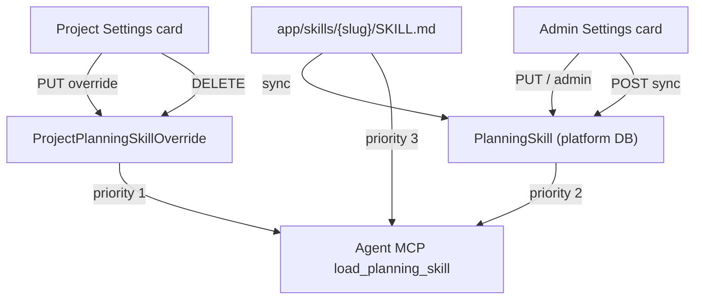

# Skills maintenance — Settings UI plan

**Status:** Plan only — do not implement until explicitly requested.  
**Scope:** Platform-level (global admin) and project-level (Maintainer+) planning skill maintenance in the Settings hub.

---

## Why this exists

Planning skills (`SKILL.md` content) drive agent-guided flows such as draft project grilling. The hub already persists and resolves skills; the web app does not expose them yet.

| Layer | Resolution order | Storage today |
|-------|------------------|---------------|
| **Effective content** | Project override → global DB → filesystem `app/skills/{slug}/SKILL.md` | `getEffectiveSkillContent()` |
| **Platform (global)** | DB (+ optional sync from filesystem) | `PlanningSkill`, `PlanningSkillRevision` |
| **Project** | Per-project override only | `ProjectPlanningSkillOverride` |

Agents load skills via `GET /api/agent/planning/skills/:slug` (platform session) and MCP `load_planning_skill`. Humans have **no Settings UI** for edit, sync, or override management.

---

## Current API surface (implemented, not in OpenAPI)

### Platform — admin only (`requireAdmin`)

| Method | Path | Purpose |
|--------|------|---------|
| `GET` | `/api/admin/planning-skills` | List global DB skills (`slug`, `contentHash`, `updatedAt`) |
| `POST` | `/api/admin/planning-skills/sync` | Import/update from `app/skills/` filesystem |
| `GET` | `/api/admin/planning-skills/:slug` | Effective global content (no project override) |
| `PUT` | `/api/admin/planning-skills/:slug` | Upsert global skill + revision row |
| `GET` | `/api/admin/planning-skills/:slug/revisions` | Last 20 revisions |
| `POST` | `/api/admin/planning-skills/:slug/revert` | Restore revision (`revisionId`) |

### Project — membership (`/api/projects/:projectId/planning/skills`)

| Method | Path | Role | Purpose |
|--------|------|------|---------|
| `GET` | `/:slug` | Viewer+ | Effective content (override applied) |
| `PUT` | `/:slug` | Maintainer+ | Upsert project override |

### Agent — platform session

| Method | Path | Purpose |
|--------|------|---------|
| `GET` | `/api/agent/planning/skills/:slug?projectId=` | Load effective skill for MCP/CLI |

### Filesystem defaults (dev/deploy)

- `app/skills/project-planning-grill/SKILL.md` (only bundled skill today)
- `syncFilesystemDefaultsToDb()` on hub startup or admin **Sync**

---

## Gaps before UI

| Gap | Impact | Proposed fix |
|-----|--------|--------------|
| **Not in OpenAPI** | No generated frontend types; contract drift | Add schemas + paths; validate → sync → gen-types |
| **No skill catalog endpoint** | UI cannot list filesystem-only skills not yet synced | `GET /api/admin/planning-skills/catalog` — merge FS slugs + DB rows + `source: filesystem \| db \| both` |
| **No project override list** | Project card cannot show “customized” badges | `GET /api/projects/:id/planning/skills` — slugs with override + `updatedAt` |
| **No project override delete** | Cannot reset to global default from UI | `DELETE /api/projects/:id/planning/skills/:slug` — Maintainer+ |
| **No project revisions** | Safer editing only on platform today | **Defer** — v1 uses single override + “Reset to platform default” |
| **No integration tests** | Regressions invisible | Add hub tests for catalog, project list, delete override |
| **No frontend API module** | — | `planningSkillsApi.ts` + composables |

---

## UX design

### Placement (Settings hub — one card each, not a new nav section)

Follow existing pattern: **SettingsCard** inside **DraggableSettingsGrid**, same as Agents / Project acceptance.

| Surface | Section | Card name | Who sees it | Who edits |
|---------|---------|-----------|-------------|-----------|
| **Platform** | `Settings → Administration` (`AdminSection.vue`) | **Planning skills (platform)** | Global admin | Global admin |
| **Project** | `Settings → Project Settings` (`WorkspaceSection.vue`) | **Planning skills (project)** | All project members | Maintainer+ |

Rationale: skills are planning infrastructure, not account/agent identity—parallel to **Project acceptance** card (draft flow) already on project settings.

### Platform card — behaviors

1. **Skill table** — columns: Slug, Source (filesystem / DB / both), Updated, Override hash (truncated), Actions.
2. **Sync from repo** — button → `POST .../sync`; toast with `{ synced: N }`.
3. **Edit** — slide-over or modal with monospace markdown editor (`content` max 32 KB); frontmatter hint in help text.
4. **Revisions** — secondary panel: timestamp, author id, **Revert** (confirm dialog).
5. **Preview** — read-only render optional v2; v1 monospace editor is enough.
6. **Create skill** — v2; v1 only edits slugs that exist in catalog (post-sync).

Empty state: “No skills in database. **Sync from repository** to import `app/skills/`.”

### Project card — behaviors

1. **Scoped to active project** (same project drawer as other Project Settings cards).
2. **Skill table** — all catalog slugs; column **Status**: `Platform default` | `Project override` (badge).
3. **View effective** — read-only fetch `GET .../skills/:slug` (what agents receive for this project).
4. **Customize** — Maintainer+ opens editor prefilled with **effective** content; save → `PUT` override.
5. **Reset** — Maintainer+ `DELETE` override → back to platform/FS resolution chain.
6. **Permission notice** — Viewers see table + effective preview only (matches `PermissionNotice` elsewhere).

Link-out: “Platform defaults are managed in **Administration → Planning skills**” (admins only).

### Resolution indicator (both cards)

Small callout when viewing a slug:

```
Effective for project 10:
  ✓ project override
  → else platform DB
  → else app/skills/{slug}/SKILL.md
```

Project card highlights which step applied. Platform card shows DB vs filesystem drift (hash mismatch → “Sync available”).

---

## Data flow



---

## Implementation phases

Per repo convention: **OpenAPI → hub gaps → platform card → project card → docs**. One card at a time in Settings.

### Phase 0 — Contract & tests

1. Add OpenAPI paths/schemas for existing admin + project + agent planning-skill routes.
2. `npm run openapi:validate` (hub) → `openapi:sync` → `check-sync` → `gen-types` (frontend).
3. Hub integration tests: admin list/sync/put/revert; project get/put; effective resolution with override.

### Phase 1 — Hub API completions

1. `listSkillCatalog()` service — union filesystem slugs + `planningSkill` rows.
2. `GET /api/admin/planning-skills/catalog`.
3. `listProjectSkillOverrides(projectId)`.
4. `GET /api/projects/:projectId/planning/skills` (index).
5. `deleteProjectSkillOverride(projectId, slug)` + `DELETE` route.
6. Extend OpenAPI + tests.

### Phase 2 — Frontend shared layer

1. `frontend/src/api/v1/planningSkillsApi.ts` — admin + project methods.
2. Composables:
   - `usePlanningSkillsCatalogQuery()` (admin)
   - `usePlanningSkillEditor(slug, scope: 'platform' | 'project', projectId?)`
   - `useProjectPlanningSkillsQuery(projectId)`
3. Shared `PlanningSkillEditorDialog.vue` (markdown textarea, byte counter, validation errors from hub).

### Phase 3 — Platform Settings card

1. `PlatformPlanningSkillsCard.vue` in `AdminSection.vue` grid.
2. Wire sync, edit, revisions, revert.
3. i18n keys under `settingsHub.admin.planningSkills.*`.
4. Register card id in settings layout store defaults (admin section).

### Phase 4 — Project Settings card

1. `ProjectPlanningSkillsCard.vue` in `WorkspaceSection.vue` grid (near `ProjectPlanningAcceptCard`).
2. Wire list, effective preview, customize, reset.
3. i18n `settingsHub.project.planningSkills.*`.
4. Maintainer gating via `useSettingsPermissions` / existing role checks.

### Phase 5 — Docs

1. `docs/user/settings-guide.md` — two new card rows.
2. `docs/user/agents.md` — pointer: skill content editable in Settings.
3. `docs/developer/API_UI_COVERAGE.md` — mark planning-skills covered.
4. Optional: short admin runbook for sync-on-deploy.

---

## Out of scope (v1)

| Item | Reason |
|------|--------|
| Project-level revision history | Add after reset-to-default proves sufficient |
| In-browser SKILL.md lint beyond hub `scanSkillContent` | Keep server validation authoritative |
| Non-planning agent skills (tool prompts, rust MCP registry) | Different product surface |
| Public skill marketplace | Platform admin + project override only |
| Editing skills from Explore or board | Settings hub only |

---

## Open questions (decide before Phase 3)

1. **Markdown editor** — plain `<textarea>` (v1) vs existing doc editor component?
2. **New slug creation** — allow admin `PUT` with novel slug, or sync-only catalog?
3. **Hub startup sync** — auto `syncFilesystemDefaultsToDb()` on boot, or manual-only via admin card?
4. **Project card when project is DRAFT** — emphasize grill skill override for acceptance flow?

---

## IMPLEMENTATION CHECKLIST

1. Document OpenAPI schemas: `PlanningSkillSummary`, `PlanningSkillContent`, `PlanningSkillRevision`, `ProjectPlanningSkillOverride`, `PlanningSkillCatalogEntry`.
2. Add OpenAPI paths for all existing admin/project/agent planning-skill routes.
3. Run hub `openapi:validate` and frontend sync/gen-types pipeline.
4. Add hub integration tests for current admin + project routes.
5. Implement `listSkillCatalog()` in `planning-skills.ts`.
6. Add `GET /api/admin/planning-skills/catalog`.
7. Implement `listProjectSkillOverrides(projectId)`.
8. Add `GET /api/projects/:projectId/planning/skills` (index).
9. Implement `deleteProjectSkillOverride()` + `DELETE` route.
10. Extend OpenAPI and integration tests for new routes.
11. Create `frontend/src/api/v1/planningSkillsApi.ts`.
12. Create composables `usePlanningSkillsCatalogQuery`, `useProjectPlanningSkillsQuery`, `usePlanningSkillMutations`.
13. Create shared `PlanningSkillEditorDialog.vue`.
14. Create `PlatformPlanningSkillsCard.vue`; mount in `AdminSection.vue`.
15. Add admin i18n strings and settings layout card id.
16. Create `ProjectPlanningSkillsCard.vue`; mount in `WorkspaceSection.vue`.
17. Add project i18n strings and settings layout card id.
18. Update `docs/user/settings-guide.md`, `docs/user/agents.md`, `docs/developer/API_UI_COVERAGE.md`.
19. Manual smoke: sync grill skill, edit platform copy, project override, agent `load_planning_skill` sees override, reset override.

---

*Related code:* `hub/src/services/planning-skills.ts`, `hub/src/api/routes/admin/planning-skills.ts`, `hub/src/api/routes/project-planning-skills.ts`, `app/skills/project-planning-grill/SKILL.md`.
