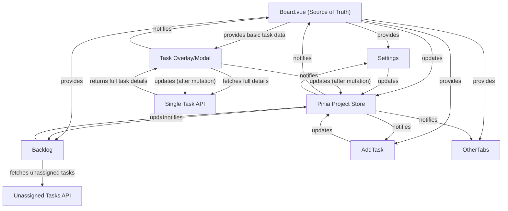

# Kanban Board, Task, and Comment — Practical Design Patterns

> **Purpose:** This document is the authoritative guide for developers working on the Kanban board and its children (modals, settings, backlog, add task, etc.). It replaces the theory doc (`parent_child_data_sync.md`) with actionable, real-world patterns for data flow, state management, and UI updates.

---

## 1. Board.vue: The Source of Truth
- **Board.vue** fetches all board data (columns, tasks, members) via Vue Query and stores it in the Pinia project store.
- All board children (modals, settings, backlog, add task, etc.) must read and update data via the shared store, not via independent API calls (except for special cases like Backlog).

**Example:**
```js
// Board.vue
const { data: boardData } = useQuery({
  queryKey: ['board', projectId],
  queryFn: fetchBoardData,
})
watch(boardData, (newData) => {
  projectStore.setProject(newData)
})
```

---

## 2. State Management: Vue Query + Pinia
- Use **Vue Query** for all API fetches and mutations.
- Use **Pinia stores** for global state (project, tasks, members, etc.).
- Children access data via Pinia, not direct API calls.

**Example:**
```js
// In a child component
const projectStore = useProjectStore()
const columns = computed(() => projectStore.project.columns)
```

---

## 2a. Pinia Best Practices: storeToRefs and Type Safety

- **Always use `storeToRefs` from Pinia** when destructuring state from a Pinia store in your components. This ensures you get reactive refs and preserves type safety, especially for arrays and objects.
- **This applies to all Pinia stores** (tasks, columns, members, etc.), not just tasks. Use `storeToRefs` for any Pinia state you want to use reactively in your components.
- **Why?** If you destructure directly (e.g., `const { items } = useTasksStore()`), you lose reactivity and may get type errors with `.value`. Using `storeToRefs` (e.g., `const { items } = storeToRefs(useTasksStore())`) gives you refs, so `items.value` works everywhere.
- **Pattern:**
```js
import { useTasksStore } from '@/stores/tasks'
import { storeToRefs } from 'pinia'

const tasksStore = useTasksStore()
const { items } = storeToRefs(tasksStore)
// Now use items.value for all reads/writes
```
- **For actions and methods** (e.g., `updateItem`, `addComment`), call them directly on the store (e.g., `tasksStore.updateItem(...)`). These are not refs and do not need `.value`.
- **For state** (e.g., `items`, `item`, `loadingItem`), always use the ref from `storeToRefs`.
- **Troubleshooting:** If you see a TypeScript error like `Property 'value' does not exist on type ...`, you are probably destructuring directly from the store instead of using `storeToRefs`. Switch to `storeToRefs` and use `.value`.
- **For v-model bindings:** If a Pinia state property can be `undefined` (e.g., `column.tasks`), use a non-null assertion (`v-model="column.tasks!"`) or a default value (`v-model="column.tasks || []"`) to ensure the binding always receives an array.
- **This pattern avoids all `.value` errors** and ensures your code is robust, type-safe, and compatible with Vue's reactivity system.

---

## 3. Mutations: How to Update Data
- All mutations (add/edit/delete task, column, etc.) must:
  1. Use the appropriate Pinia store action (which calls the API via Vue Query).
  2. On success, **invalidate or refetch** the relevant Vue Query queries (e.g., ['board', projectId], ['task', taskId]).
  3. The UI will update reactively via the store.

**Example:**
```js
// In TaskDialog.vue
await tasksStore.updateItem(taskId, payload)
await queryClient.invalidateQueries(['board', projectId])
```

---

## 4. Modals & Overlays: Hybrid Data Flow
- Modals (e.g., TaskDialog) should:
  1. Prefill with basic task data from the board (via Pinia store) for instant feedback.
  2. Fetch full task details (comments, history, etc.) from the single task API using Vue Query.
  3. Merge detailed data into the modal state.
  4. After mutations, update both the single task API and the board, then invalidate/refetch queries.

**Example:**
```js
// Open modal with board task
const basicTask = projectStore.getTaskById(taskId)
// Fetch full details
const { data: fullTask } = useQuery(['task', taskId], fetchTask)
```
- **Tip:** When binding Pinia state to a v-model in a modal or overlay, always ensure the value is never undefined. Use `v-model="someArray!"` or `v-model="someArray || []"` if the state can be undefined. This prevents runtime and type errors.

---

## 5. Special Cases: Backlog, Settings, Add Task
- **Backlog:**
  - Fetches unassigned tasks from a separate API endpoint.
  - When a task is assigned, update the board store and remove from backlog.
- **Settings/Add Task:**
  - Always update the shared store and invalidate/refetch board data after changes.

---

## 6. Data Source & Update Table
| Data Source         | Used For         | Store/Query         | When to Update/Refetch                |
|---------------------|------------------|---------------------|---------------------------------------|
| Board API           | Board, columns, basic tasks | Pinia project store, Vue Query | On board load, after board-level mutations |
| Single Task API     | Full task details (comments, history, etc.) | Pinia tasks store, Vue Query | On modal open, after task-level mutations  |
| Pinia project store | Board-wide state | All board children  | After board or task mutations         |
| Pinia tasks store   | Modal state      | TaskDialog          | On modal open, after task mutations   |

---

## 7. Do's and Don'ts
**Do:**
- Always use the Pinia store for reading/updating board/task data.
- Always invalidate/refetch Vue Query queries after mutations.
- Prefill modals with store data, then fetch full details as needed.
- Keep all children in sync by listening to store changes.

**Don't:**
- Don't fetch or mutate board/task data directly in children (except Backlog for unassigned tasks).
- Don't keep local copies of board/task data in children.
- Don't forget to update the store and invalidate queries after mutations.

---

## 8. Extending the Pattern
- For new board children (e.g., Settings, Add Task):
  - Always use the shared store for data.
  - Always update the store and invalidate/refetch queries after changes.
  - Follow the modal hybrid pattern for overlays.

---

## 9. Reference
- For background and rationale, see `parent_child_data_sync.md` (theory doc).

---

## 10. Diagram: Data Flow


---

**End of document.** 