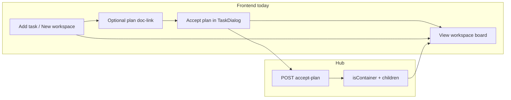

# OpenAPI ↔ Frontend UI Gap Analysis

This document maps **hub OpenAPI capabilities** to **what the Vue frontend actually exposes in the UI**. It complements path/param alignment work: the goal is feature coverage and product gaps, not whether query strings match.

**Spec source:** `hub/src/openapi.json` (canonical), copied to `frontend/openapi.json` via `npm run openapi:sync` from `frontend/` or `npm run openapi:sync-fe` from `hub/`.

**Last reviewed:** 2026-05-30 (Task archive OpenAPI contract, backlog/archive wall, Explore fleet scope toggle).

---

## How to read this doc

| Label | Meaning |
|-------|---------|
| **Covered** | Typical users can drive the capability from the SPA |
| **Partial** | API client or types exist; workflow incomplete or narrow entry point |
| **Gap** | Contract exposes capability; no meaningful UI |
| **Agent-only** | `/api/agent/*` — MCP/CLI, not web UI (by design) |
| **UI-only** | Frontend calls a hub route **not** documented in OpenAPI |

Human-facing OpenAPI: **~86 operations** across **75 paths**. Agent MCP surface: **21 operations** under `/api/agent/*`.

---

## `POST /api/tasks` and workspace fields

Hub create persists `isContainer`, `parentId`, and `subBoardOutlineColor` (with validation when `parentId` + `isContainer` conflict).

**Add New Task** exposes a **Create as workspace** checkbox (`isContainer: true`), optional **Workspace** membership dropdown on the main board, and sends **`parentId`** when the route is a workspace board (`?workspace=` on main board or **SubBoard** `parentId` param).

---

## Workspaces (container tasks)

### API model

| Concept | Implementation |
|---------|----------------|
| Container | Task with `isContainer: true` |
| Child task | Task with `parentId` set to container id |
| Plan expansion | `accept-plan` parses `##` / `###` headings from linked `IMPLEMENTATION_PLAN` doc |
| Workspace list | `GET /api/projects/{id}/active-workspaces` |
| Workspace board | `GET /api/projects/{id}/board?parentId={containerId}` |
| Fleet stats | `GET /api/projects/summary?scope=main\|all\|workspace:…` → `ProjectStats` |

### UI coverage

| User intent | API | UI status |
|-------------|-----|-----------|
| Switch between workspaces | `GET .../active-workspaces` | **Covered** — `ProjectView`, `BoardTopbar` |
| View workspace kanban | `GET .../board?parentId=` | **Covered** — `SubBoardView`, `?workspace=` on main board |
| Accept plan → container + children | `POST .../accept-plan/{taskId}` | **Partial** — `TaskDialog`; requires `IMPLEMENTATION_PLAN` doc-link and Maintainer+ |
| New workspace / mark as container | `POST` with `isContainer` | **Covered** — **New workspace** tab, Add New Task checkbox, Task dialog checkbox |
| Add child on workspace board | `POST /api/tasks` with `parentId` | **Covered** — `AddNewTaskDialog` when `?workspace=` or SubBoard route |
| Edit outline color | `subBoardOutlineColor` on task / settings | **Covered** — project default in Settings; per-task in Task dialog for workspace roots |
| Column protection on workspace | `PATCH /api/projects/{id}/settings` | **Covered** — Project Settings → Columns |
| Explore column totals | `GET /api/projects/summary` | **Covered** — `ExploreProjectsView`, **Main board** / **All tasks** toggle (`scope=main\|all`) |
| Assign membership without drag | `PATCH` `parentId` | **Covered** — Task dialog **Workspace** dropdown |

---

## Backlog, archive, and batch status

### API model (2026-05-30)

| Concept | Implementation |
|---------|----------------|
| Backlog | `projectColumnId` null, `archivedAt` null — `GET /api/tasks?noColumn=true&archived=false` |
| Archive | `Task.archivedAt` set — `GET /api/tasks?archived=true`; board columns exclude archived rows |
| Restore / assign | `PATCH /api/tasks/{id}` with `projectColumnId` and/or `archived: false` |

**OpenAPI:** `Task.archivedAt`, `UpdateTaskRequest.archived`, and `GET /api/tasks` query params `archived` / `noColumn` are documented in `hub/src/openapi.json` (types synced to frontend).

### UI coverage

| User intent | API | UI status |
|-------------|-----|-----------|
| View backlog tasks (no column) | `GET /api/tasks?…` | **Covered** — stats bar **Backlog** → card wall (`TaskWall`) on Board + Grid |
| View archived tasks | `GET /api/tasks?archived=true` | **Covered** — stats bar **Archive** → card wall |
| Batch move backlog/archive tasks to column | `PATCH` per task | **Covered** — multi-select cards + batch status dropdown + **Apply** |
| Set status from task dialog | `PATCH` | **Covered** — **Backlog** / columns / **Archive** in `TaskCoreFields` |
| Drag backlog onto board | `POST .../move` | **Gap** — wall view uses PATCH batch only (no DnD columns) |

Project views share **`boardCountMode`**: `main` \| `all` \| `backlog` \| `archive` via `ProjectStatsBar` → `Board` / `ProjectGrid`.

---

## Gap matrix (OpenAPI → UI)

Operations with **no or minimal UI**. Agent-only routes omitted here (see [Agent API](#agent-api-by-design)).

| Method | Path | Summary | Notes |
|--------|------|---------|-------|
| `GET` | `/api/projects/{id}/summary` | Project stats + members | **Covered** — `ProjectStatsBar` on project views (`scope=main` or `workspace:{id}`) |
| `GET` | `/api/tasks` | List/filter tasks | **Covered** — backlog/archive stores use documented `archived` / `noColumn` filters |
| `PATCH` | `/api/tasks/{id}` | Update task | **Covered** — `UpdateTaskRequest` includes `archived`; responses expose `archivedAt` |
| `DELETE` | `/api/tasks/{id}` | Delete task | OpenAPI documented; no delete control in UI |
| `POST` | `/api/tasks/{id}/monitor-pass/{columnId}` | Record monitor pass | Types only |
| `DELETE` | `/api/tasks/{id}/monitor-pass/{columnId}` | Clear monitor pass | Types only |
| `POST` | `/api/tasks/{id}/monitor-reject/{columnId}` | Reject to previous column | Types only |
| `GET` | `/api/admin/audit-log` | Admin audit log | Admin UI has no audit viewer |
| `POST` | `/api/admin/rate-limits` | Create rate limit config | Admin UI: get/put/toggle only |
| `DELETE` | `/api/admin/rate-limits/{id}` | Delete rate limit config | Not exposed |
| `POST` | `/api/logout` | Logout | SPA clears token locally; no API call |
| `POST` | `/api/signin` | Sign-in alias | UI uses `/api/login` |
| `POST` | `/api/signup` | Sign-up alias | UI uses `/api/register` |

---

## Partial coverage

| Area | Operation(s) | Gap detail |
|------|----------------|------------|
| **Plan / workspace** | `POST .../accept-plan` | Single entry: task dialog after plan doc-link |
| **Workspaces — UX** | `parentId` | No drag-onto-workspace; dropdown + create-on-workspace-board only |
| **Project summaries** | `scope=workspace:…` | **Covered** — workspace board via `ProjectStatsBar`; fleet Explore has **Main board / All tasks** toggle; project Board/Grid adds backlog / archive |
| **Documents** | CRUD + search | **Covered** — `DocsView` wires `DocumentSearchOverlay` and delete (list + editor) |
| **Projects — delete** | `DELETE /api/projects/{id}` | Implemented in settings / explore |
| **Comments** | `PATCH /api/tasks/comment/{id}` vs `POST .../comments` | UI uses legacy PATCH; both routes exist on hub |

---

## Well covered (reference)

| Domain | Primary UI |
|--------|------------|
| Auth | `LoginView`, `SignUpView`, session restore |
| Projects | Explore (stats summary), board, settings, create/delete |
| Tasks | Board, backlog/archive walls, dialogs, drag → `POST .../move`, relations, workspace + archive on PATCH |
| Columns | Board, workspace settings |
| Members | Project members, invite, role patch |
| Search | `SearchInput`, overlays |
| Documents | `DocsView`, `TaskDialog` doc-links |
| Human agents | Settings → Agents, delegations |
| Account | Settings hub — profile, password, preferences, sessions, layout |
| Admin (most) | Rate limits, users, health, platform agents |

---

## OpenAPI spec accuracy (recent fixes)

| Issue | Status |
|-------|--------|
| Incomplete `POST /api/tasks` body | **Fixed** — `isContainer`, `parentId`, `subBoardOutlineColor` |
| Human `GET /projects/summary` → `ProjectStats` | **Fixed** — legacy `ProjectSummary` removed |
| Wrong `DELETE /api/tasks/{id}` summary | **Fixed** — “Delete task” |
| Board payload missing relations | **Fixed** — `GET .../board` includes relation fields |
| Task archive / backlog filters | **Fixed** — `archivedAt`, `UpdateTaskRequest`, `archived` / `noColumn` query params; types regenerated |

---

## Relations and board UX

| Capability | Status |
|------------|--------|
| Relation badge on board cards | **Covered** — `TaskTile` |
| Block Done when blocked-by open | **Covered** — hub `task-relation-policy` + board toast on 403 |
| WebSocket partial upserts | **Covered** — `mergeBoardTaskFromWebsocket` preserves relation chips |

---

## Agent API (by design)

**21 operations** under `/api/agent/*` for **VibeTask MCP** / CLI (`app/crates/vibetask-mcp`). Not expected in the SPA. See [`docs/user/agents.md`](../../docs/user/agents.md).

---

## Verification tips

1. Refresh spec: `cd frontend && npm run openapi:sync`
2. Regenerate types: `cd frontend && npm run openapi:gen-types`
3. For behavior vs docs: prefer **GitNexus** `context` / `impact` on route handlers under `hub/src/api/routes/`
4. Re-run this pass after large API or Explore/workspace changes

---

## Suggested implementation priority (product)

1. **Workspaces:** drag-into-workspace for membership (v1 uses dialog dropdown)
2. **Backlog wall:** drag backlog tasks onto board columns (wall uses PATCH batch only today)
3. Monitor pass/reject and task delete if review-column workflow needs SPA controls
4. Remove unused `ProjectSummary` OpenAPI schema (cleanup PR)

---

## Supersedes

This document replaces **`API_CONTRACT_REVIEW.md`**, which tracked path/param alignment only and is no longer maintained.
