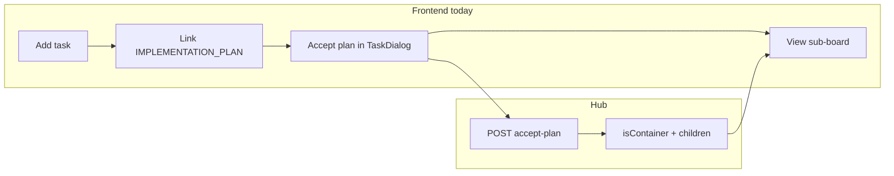

# OpenAPI ↔ Frontend UI Gap Analysis

This document maps **hub OpenAPI capabilities** to **what the Vue frontend actually exposes in the UI**. It complements path/param alignment work: the goal is feature coverage and product gaps, not whether query strings match.

**Spec source:** `hub/src/openapi.json` (canonical), copied to `frontend/openapi.json` via `npm run openapi:sync` from `frontend/` or `npm run openapi:sync-fe` from `hub/`.

**Last reviewed:** 2026-05-19 (code + GitNexus symbol traces; narrative docs may lag).

---

## How to read this doc

| Label | Meaning |
|-------|---------|
| **Covered** | Typical users can drive the capability from the SPA |
| **Partial** | API client or types exist; workflow incomplete or narrow entry point |
| **Gap** | Contract exposes capability; no meaningful UI |
| **Agent-only** | `/api/agent/*` — MCP/CLI, not web UI (by design) |
| **UI-only** | Frontend calls a hub route **not** documented in OpenAPI |

Human-facing OpenAPI: **~86 operations** across **75 paths**. Agent MCP surface: **21 operations** under `/api/agent/*`.

---

## `POST /api/tasks` and `isContainer` (fixed 2026-05-19)

Hub create now persists `isContainer` and `subBoardOutlineColor`; `parentId` + `isContainer` together are rejected. OpenAPI documents these fields on `POST /api/tasks`.

**Add New Task** exposes a **workspace container** checkbox (`isContainer: true`). Accept-plan and `PATCH` remain alternate paths. Sub-boards are still container tasks plus optional `parentId` children — not a separate REST resource.

---

## Sub-boards (container tasks)

### API model

| Concept | Implementation |
|---------|----------------|
| Container | Task with `isContainer: true` |
| Child task | Task with `parentId` set to container id |
| Plan expansion | `accept-plan` parses `##` / `###` headings from linked `IMPLEMENTATION_PLAN` doc |
| Workspace list | `GET /api/projects/{id}/active-workspaces` — containers with metadata |
| Sub-board board | `GET /api/projects/{id}/board?parentId={containerId}` |

### UI coverage

| User intent | API | UI status |
|-------------|-----|-----------|
| Switch between sub-boards | `GET .../active-workspaces` | **Covered** — `ProjectView`, `BoardTopbar` |
| View sub-board kanban | `GET .../board?parentId=` | **Covered** — `SubBoardView` |
| Accept plan → create container + children | `POST .../accept-plan/{taskId}` | **Partial** — `TaskDialog` only; requires `IMPLEMENTATION_PLAN` doc-link and Maintainer+ |
| “New sub-board” / mark task as container | `POST` with `isContainer` | **Partial** — Add New Task checkbox; accept-plan still primary for spawning children |
| Add child task on sub-board | `POST /api/tasks` with `parentId` | **Gap** — `AddNewTaskDialog` never sends `parentId` |
| Edit outline color | `subBoardOutlineColor` on task / project settings | **Gap** — display only |
| Column protection on sub-board | `PATCH /api/projects/{id}/settings` | **Partial** — Workspace → Columns card: enter/exit role policies + Save move policies |

---

## Gap matrix (OpenAPI → UI)

Operations with **no or minimal UI**. Agent-only routes omitted here (see [Agent API](#agent-api-by-design)).

| Method | Path | Summary | Notes |
|--------|------|---------|-------|
| `PATCH` | `/api/projects/{id}/settings` | Update project settings | **Partial** — column enter/exit policies in Workspace settings; default `subBoardOutlineColor` still no editor |
| `GET` | `/api/projects/{id}/summary` | Project summary | No summary dashboard |
| `DELETE` | `/api/tasks/{id}` | Delete task | OpenAPI summary fixed; still no delete control in UI |
| `POST` | `/api/tasks/{id}/monitor-pass/{columnId}` | Record monitor pass | Types only |
| `DELETE` | `/api/tasks/{id}/monitor-pass/{columnId}` | Clear monitor pass | Types only |
| `POST` | `/api/tasks/{id}/monitor-reject/{columnId}` | Reject to previous column | Types only |
| `GET` | `/api/admin/audit-log` | Admin audit log | Admin UI has no audit viewer |
| `POST` | `/api/admin/rate-limits` | Create rate limit config | Admin UI: get/put/toggle only |
| `DELETE` | `/api/admin/rate-limits/{id}` | Delete rate limit config | Not exposed |
| `POST` | `/api/logout` | Logout | SPA clears token locally; no API call |
| `POST` | `/api/signin` | Sign-in alias | UI uses `/api/login` |
| `POST` | `/api/signup` | Sign-up alias | UI uses `/api/register` |

---

## Partial coverage

| Area | Operation(s) | Gap detail |
|------|----------------|------------|
| **Tasks — create** | `POST /api/tasks` | **Partial** — optional `isContainer` checkbox; `parentId` still not sent from Add New Task |
| **Tasks — update** | `PATCH /api/tasks/{id}` | Hub allows `isContainer`, `subBoardOutlineColor`, `parentId`; `TaskDialog` save does not send them |
| **Plan / sub-board** | `POST .../accept-plan` | Single entry: task dialog after plan doc-link |
| **Documents** | CRUD + search | `deleteDocument` and `useDocumentSearch` exist; `DocsView` does not wire delete or `DocumentSearchOverlay` |
| **Projects — delete** | `DELETE /api/projects/{id}` | Implemented in settings / explore (easy to miss in spec-only reviews) |
| **Comments** | `PATCH /api/tasks/comment/{id}` vs `POST .../comments` | UI uses legacy PATCH; both routes exist on hub |

---

## Well covered (reference)

| Domain | Primary UI |
|--------|------------|
| Auth | `LoginView`, `SignUpView`, session restore |
| Projects | Explore, board, settings, create/delete |
| Tasks | Board, backlog, dialogs, drag → `POST .../move` |
| Columns | Board, workspace settings |
| Members | Project members, invite, role patch |
| Search | `SearchInput`, overlays |
| Documents | `DocsView`, `TaskDialog` doc-links |
| Human agents | Settings → Agents, delegations |
| Account | Settings hub — profile, password, preferences, sessions, layout |
| Admin (most) | Rate limits, users, health, platform agents |

---

## OpenAPI spec accuracy (recent fixes)

| Issue | Status |
|-------|--------|
| Incomplete `POST /api/tasks` body | **Fixed** — documents `isContainer`, `parentId`, `subBoardOutlineColor` |
| Wrong `DELETE /api/tasks/{id}` summary | **Fixed** — “Delete task” |
| Missing `GET /projects/templates`, `GET /projects/{id}/delegates` | **Fixed** in spec |
| Duplicate comment paths | Still two routes; UI uses legacy PATCH |
| Board payload missing relations | **Fixed** — `GET .../board` includes `relationMode`, `relationId`, `relatedTask` |

---

## Relations and board UX (2026-05-19)

| Capability | Status |
|------------|--------|
| Relation badge on board cards | **Covered** — `TaskTile` |
| Block Done when blocked-by open | **Covered** — hub `task-relation-policy` + board toast on 403 |
| Remove invalid “Duplicated by” create option | **Fixed** — enum is `duplicate-of` only |

---

## Agent API (by design)

**21 operations** under `/api/agent/*` for **VibeTask MCP** / CLI (`app/crates/vibetask-mcp`). Not expected in the SPA. See [`docs/user/agents.md`](../../docs/user/agents.md) for platform session vs delegate agents.

---

## Verification tips

1. Refresh spec: `cd frontend && npm run openapi:sync`
2. Regenerate types: `cd frontend && npm run openapi:generate` (if scripted)
3. For behavior vs docs: prefer **GitNexus** `context` / `impact` on API wrappers (e.g. `acceptPlan`, `getActiveWorkspaces`) and read hub route handlers under `hub/src/api/routes/`
4. Do not rely on this file alone after large API changes — re-run a gap pass against `openapi.json` and `frontend/src/api/`

---

## Suggested implementation priority (product)

1. Sub-board: send `parentId` from Add New Task on sub-board views; dedicated “New sub-board” flow beyond checkbox + accept-plan
2. Project settings: default `subBoardOutlineColor` editor; outline color on tasks
3. Documents: wire search overlay and delete in `DocsView`
4. Monitor pass/reject and task delete if review-column workflow is required
5. TaskDialog PATCH: expose `isContainer` / `subBoardOutlineColor` for edit-in-place

---

## Supersedes

This document replaces **`API_CONTRACT_REVIEW.md`**, which tracked path/param alignment only and is no longer maintained.
