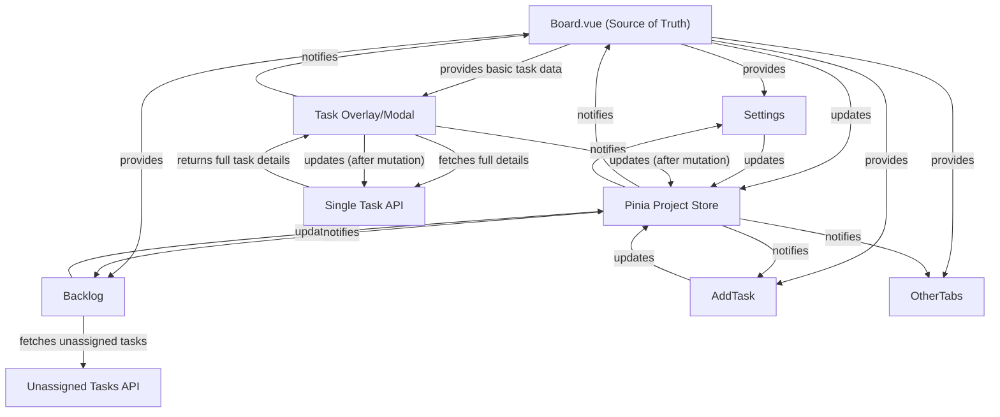
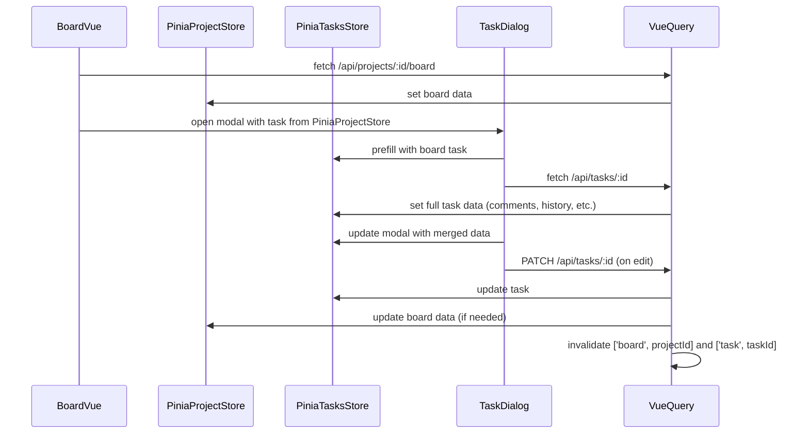

# Parent-Child Data Synchronization in Kanban Board

## Overview

To ensure a robust, maintainable, and consistent user experience, the Kanban app should treat `Board.vue` as the parent and **single source of truth** for all project/board data. All tab pages and modals (Settings, Backlog, Add Task, etc.) should be children that read from and update this shared state, rather than fetching or mutating data independently.

---

## Current State
- **Board.vue** fetches all board data (columns, tasks, members, etc.) in one API call and manages it locally and via Vue Query.
- **Children (Settings, Backlog, Add Task, etc.)** often fetch their own data or use separate stores, leading to possible inconsistencies.
- **Backlog** is a special case: it tracks unassigned tasks, which are not included in the board API response and are fetched from a separate API endpoint.

---

## Target Architecture

### Data Flow
- **Board.vue** fetches and owns the canonical project/board data.
- **Board.vue** provides this data to all children via props, provide/inject, or by updating a global Pinia store.
- **All mutations (edits, adds, deletes) go through Board.vue or update the shared store/query.**
- **After any mutation, the shared data is updated and/or queries are invalidated/refetched** so all children see the latest state.
- **No child independently fetches or caches project/board data, except Backlog for unassigned tasks.**

### Special Case: Backlog and the Extra Data Feed
- **Backlog** fetches unassigned tasks from a separate API endpoint (e.g., `/api/tasks?projectId=...&unassigned=true`).
- **Backlog** is the only child that consumes this extra data feed.
- When a backlog task is assigned to a column, Backlog updates the shared store so the task is removed from the backlog and added to the appropriate column in the board data.
- This ensures the board and backlog remain in sync, even though their data sources are slightly different.

---

## Data Flow Diagram (with Backlog Extra Feed)



---

## Actionable Steps for Alignment

1. **Board.vue as Source of Truth**
   - Fetch all project/board data in Board.vue and store it in a global Pinia store or provide/inject context.
   - Children receive data from Board.vue, not from independent API calls (except Backlog for unassigned tasks).

2. **Centralized Mutations**
   - All data mutations (add/edit/delete task, column, etc.) are performed via Board.vue or shared store actions.
   - After a mutation, update the store and/or invalidate/refetch the relevant Vue Query cache.

3. **Backlog Handling and Extra Feed**
   - Backlog fetches unassigned tasks as needed from the Unassigned Tasks API.
   - When a backlog task is assigned to a column, it is removed from the backlog and added to the appropriate column in the board data via the shared store.
   - Backlog is responsible for reconciling unassigned tasks with the board data when state changes.

4. **Reactive Updates**
   - All children listen to changes in the shared store or provided data and update their UI reactively.
   - No child should maintain its own copy of project/board data.

5. **API Consistency**
   - Ensure all API mutations (create, update, delete) are followed by a store update or query invalidation/refetch.
   - Board.vue should always reflect the latest state after any mutation.

6. **Testing and Validation**
   - Test that changes in any child (e.g., adding a task in Add Task modal) are immediately reflected in Board.vue and all other children.
   - Validate that no stale or out-of-sync data appears after mutations.

---

## Notes
- The backlog remains a special case, but its state must always be reconciled with the board data when tasks are assigned/unassigned.
- Backlog is the only child that fetches from the Unassigned Tasks API and is responsible for merging/removing tasks as they become assigned or unassigned.
- This architecture ensures a single source of truth, reduces bugs, and improves maintainability.

---

## Task Overlay Data Flow: Board + Single Task API

### Narrative

To balance performance and detail, the Kanban app uses a hybrid approach for task overlays (modals):
- **Board.vue** fetches lightweight board data (columns, basic tasks, members) and stores it in the Pinia project store via Vue Query.
- When a user opens a task modal, the modal is immediately prefilled with the basic task data from the board (ensuring instant feedback).
- In the background, the modal fetches the full task details (including comments, history, and related tasks) from the single task API (`/api/tasks/:id`) using Vue Query and updates the Pinia tasks store.
- The modal merges the detailed data into its state, so fields like comments and history appear as soon as they are available.
- Any edits or mutations in the modal update both the single task API and, if relevant, the board data. After a mutation, the relevant Vue Query caches are invalidated/refetched to keep all views in sync.

This approach ensures:
- Fast initial modal open (no waiting for a second API call)
- Full detail in the modal (comments, history, etc.)
- Consistent state across board and modal after edits
- The board API remains lightweight and performant

### Data Flow Sequence Diagram



### Data Source Summary Table

| Data Source         | Used For         | Store/Query         | When to Update/Refetch                |
|---------------------|------------------|---------------------|---------------------------------------|
| Board API           | Board, columns, basic tasks | Pinia project store, Vue Query | On board load, after board-level mutations |
| Single Task API     | Full task details (comments, history, etc.) | Pinia tasks store, Vue Query | On modal open, after task-level mutations  |
| Pinia project store | Board-wide state | All board children  | After board or task mutations         |
| Pinia tasks store   | Modal state      | TaskDialog          | On modal open, after task mutations   |

---

## Appendix: Rendering Pinia Arrays in Vue Templates

### The plainArray (plainTasks) Pattern

When using Pinia stores with Vue 3, arrays returned from the store (e.g., via storeToRefs) are often reactive Proxies. While Vue templates can usually render these, there are edge cases—especially with third-party components or complex v-for usage—where rendering fails or is inconsistent if the array contains Proxies instead of plain objects.

**Best Practice:**
Always map your Pinia array to plain objects before rendering in a template:

```js
const plainTasks = computed(() => items.value.map(t => ({ ...t })));
```

Then use `plainTasks` in your template:

```vue
<tr v-for="task in plainTasks" :key="task.id"> ... </tr>
```

This ensures robust, predictable rendering and avoids subtle bugs with reactivity or third-party libraries.

---

## Appendix: ProjectGrid.vue Implementation & Divergences

- All grid data is sourced from Pinia stores or computed properties derived from them, following the parent-child data sync pattern.
- localTableData is always a deep clone of the computed table data for VueDraggable Plus compatibility (see code comments in ProjectGrid.vue).
- All mutations (drag, modal edit, etc.) use Pinia actions or $patch to update the store with a new array reference, never by direct mutation.
- All Pinia store data in the component is accessed via storeToRefs for robust reactivity.
- After a modal edit, the store is patched or the relevant Vue Query cache is invalidated/refetched so all children update reactively (handled by modal logic).
- No direct mutation of store state is present in ProjectGrid.vue (see code comments).
- External data update handling (e.g., via API or another tab) is not yet implemented; this is a potential enhancement (see code comments).
- Any future divergence from this pattern will be marked with // DIVERGENCE: in code and documented here with rationale and file/line references.

---

**End of document.** 