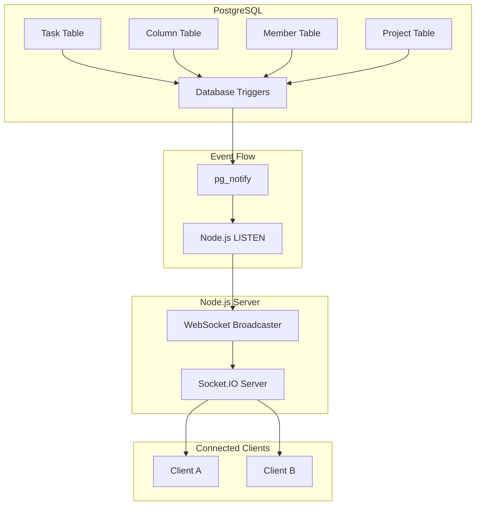

# WebSocket Broadcasting Implementation Plan

## Overview
Implement real-time WebSocket broadcasting from database changes to connected clients using PostgreSQL LISTEN/NOTIFY.

## Architecture Flow


## Implementation Steps

### Phase 1: Database Layer (1 hour)

#### 1.1 Create Database Migration
**File:** `prisma/migrations/20260304_add_websocket_triggers/migration.sql`

```sql
-- Trigger function for change notifications
CREATE OR REPLACE FUNCTION public.notify_change()
RETURNS trigger AS $$
DECLARE
    payload json;
    channel_name text;
    project_id integer;
BEGIN
    -- Extract project_id based on table
    project_id := CASE TG_TABLE_NAME
        WHEN 'Task' THEN NEW.projectId
        WHEN 'ProjectColumn' THEN NEW.projectId
        WHEN 'ProjectUser' THEN NEW.projectId
        WHEN 'Project' THEN NEW.id
        ELSE NULL
    END;

    -- Handle DELETE case (NEW is NULL)
    IF TG_OP = 'DELETE' THEN
        project_id := CASE TG_TABLE_NAME
            WHEN 'Task' THEN OLD.projectId
            WHEN 'ProjectColumn' THEN OLD.projectId
            WHEN 'ProjectUser' THEN OLD.projectId
            WHEN 'Project' THEN OLD.id
            ELSE NULL
        END;
        payload = json_build_object(
            'table', TG_TABLE_NAME,
            'action', TG_OP,
            'id', OLD.id,
            'projectId', project_id,
            'data', row_to_json(OLD)
        );
    ELSE
        payload = json_build_object(
            'table', TG_TABLE_NAME,
            'action', TG_OP,
            'id', NEW.id,
            'projectId', project_id,
            'data', row_to_json(NEW)
        );
    END IF;

    -- Determine channel based on table
    channel_name := CASE TG_TABLE_NAME
        WHEN 'Task' THEN 'db:task:change'
        WHEN 'ProjectColumn' THEN 'db:column:change'
        WHEN 'ProjectUser' THEN 'db:member:change'
        WHEN 'Project' THEN 'db:project:change'
        ELSE 'db:change'
    END;

    PERFORM pg_notify(channel_name, payload::text);
    RETURN COALESCE(NEW, OLD);
END;
$$ LANGUAGE plpgsql SECURITY DEFINER;

-- Create triggers for each table
DROP TRIGGER IF EXISTS task_change_notify ON "Task";
CREATE TRIGGER task_change_notify
AFTER INSERT OR UPDATE OR DELETE ON "Task"
FOR EACH ROW EXECUTE FUNCTION public.notify_change();

DROP TRIGGER IF EXISTS column_change_notify ON "ProjectColumn";
CREATE TRIGGER column_change_notify
AFTER INSERT OR UPDATE OR DELETE ON "ProjectColumn"
FOR EACH ROW EXECUTE FUNCTION public.notify_change();

DROP TRIGGER IF EXISTS member_change_notify ON "ProjectUser";
CREATE TRIGGER member_change_notify
AFTER INSERT OR UPDATE OR DELETE ON "ProjectUser"
FOR EACH ROW EXECUTE FUNCTION public.notify_change();

DROP TRIGGER IF EXISTS project_change_notify ON "Project";
CREATE TRIGGER project_change_notify
AFTER INSERT OR UPDATE OR DELETE ON "Project"
FOR EACH ROW EXECUTE FUNCTION public.notify_change();
```

### Phase 2: Infrastructure Layer (2 hours)

#### 2.1 Install Dependencies
```bash
npm install pg-listen
npm install -D @types/pg-listen
```

#### 2.2 Create Channel Definitions
**File:** `src/infrastructure/websocket/channels.ts`

```typescript
export const CHANNELS = {
  TASKS_INDEX: 'TasksIndexChannel',
  TASK_INDEX: 'TaskIndexChannel',
  COLUMNS_INDEX: 'ColumnsIndexChannel',
  MEMBERS_INDEX: 'MembersIndexChannel',
  MEMBER_INDEX: 'MemberIndexChannel',
  PROJECT_INDEX: 'ProjectIndexChannel',
  USER_PROJECTS: 'UserProjectsIndexChannel',
} as const;

export type ChannelParams = {
  [CHANNELS.TASKS_INDEX]: { projectId: number };
  [CHANNELS.TASK_INDEX]: { projectId: number; taskId: number };
  [CHANNELS.COLUMNS_INDEX]: { projectId: number };
  [CHANNELS.MEMBERS_INDEX]: { projectId: number };
  [CHANNELS.MEMBER_INDEX]: { projectId: number; memberId: number };
  [CHANNELS.PROJECT_INDEX]: { projectId: number };
  [CHANNELS.USER_PROJECTS]: {};
};

export function getRoomName(channel: string, params: any): string {
  return `${channel}:${JSON.stringify(params)}`;
}
```

#### 2.3 Create pg-listen Client
**File:** `src/infrastructure/database/pg-listener.ts`

```typescript
import createSubscriber from 'pg-listen';
import { broadcastToChannel } from '../websocket/broadcaster.js';

const subscriber = createSubscriber({
  connectionString: process.env.DATABASE_URL,
  retryDelay: (attempt) => Math.min(1000 * 2 ** attempt, 30000),
  retryLimit: Infinity,
});

subscriber.events.on('error', (error) => {
  console.error('[PG-LISTEN] Fatal error:', error);
});

subscriber.events.on('connected', () => {
  console.log('[PG-LISTEN] Connected to PostgreSQL');
});

subscriber.events.on('reconnected', () => {
  console.log('[PG-LISTEN] Reconnected to PostgreSQL');
});

export async function startDatabaseListener() {
  await subscriber.connect();
  
  await subscriber.listenTo('db:task:change');
  await subscriber.listenTo('db:column:change');
  await subscriber.listenTo('db:member:change');
  await subscriber.listenTo('db:project:change');
  
  subscriber.notifications.on('db:task:change', handleTaskChange);
  subscriber.notifications.on('db:column:change', handleColumnChange);
  subscriber.notifications.on('db:member:change', handleMemberChange);
  subscriber.notifications.on('db:project:change', handleProjectChange);
}

async function handleTaskChange(payload: any) {
  await broadcastToChannel('TASKS_INDEX', payload);
}

async function handleColumnChange(payload: any) {
  await broadcastToChannel('COLUMNS_INDEX', payload);
}

async function handleMemberChange(payload: any) {
  await broadcastToChannel('MEMBERS_INDEX', payload);
}

async function handleProjectChange(payload: any) {
  await broadcastToChannel('USER_PROJECTS', payload);
  await broadcastToChannel('PROJECT_INDEX', payload);
}
```

### Phase 3: Service Layer (2 hours)

#### 3.1 Event Transformers
**File:** `src/services/websocket/event-transformer.ts`

Transform database events to frontend-compatible format.

#### 3.2 Receiver Filter
**File:** `src/services/websocket/receiver-filter.ts`

Filter which clients should receive messages based on project membership.

#### 3.3 Broadcaster
**File:** `src/infrastructure/websocket/broadcaster.ts`

Broadcast transformed events to Socket.IO rooms with permission filtering.

### Phase 4: Integration (1 hour)

#### 4.1 Update src/index.ts
- Import and start pg-listen client
- Update Socket.IO room management to use `getRoomName()`
- Add health check endpoint for WebSocket

### Phase 5: Testing (2 hours)

1. Unit tests for event transformers
2. Integration tests for database → WebSocket flow
3. Frontend compatibility verification

## Files to Create

```
src/
├── infrastructure/
│   ├── database/
│   │   └── pg-listener.ts      # NEW
│   └── websocket/
│       ├── channels.ts         # NEW
│       └── broadcaster.ts      # NEW
├── services/
│   └── websocket/
│       ├── event-transformer.ts    # NEW
│       └── receiver-filter.ts      # NEW
prisma/
└── migrations/
    └── 20260304_add_websocket_triggers/
        └── migration.sql       # NEW
```

## Dependencies to Add
- `pg-listen`: PostgreSQL LISTEN/NOTIFY client with reconnection

## Total Estimated Time: 8 hours
- Phase 1: 1 hour
- Phase 2: 2 hours
- Phase 3: 2 hours
- Phase 4: 1 hour
- Phase 5: 2 hours

## Risk Assessment
- **Low Risk**: Single instance deployment, well-documented pattern
- **Mitigation**: Triggers are non-destructive; rollback by simply stopping pg-listen

## Success Criteria
1. Database changes trigger WebSocket broadcasts
2. Frontend receives messages in expected format
3. Messages filtered by project membership
4. Reconnection works after database restart
